# Integrated-Sensor-Circuit-Design-and-Data-Analysis-Web-Portal
This project focuses on developing a sensor-based system utilizing various sensors, including DHT11, DHT22, and MAX30102. The project involved comprehensive circuit design for the sensors, incorporating operations like operational amplifier filtering. An Arduino was employed to receive the sensor data, which was subsequently organized into Excel spreadsheets. This data was then imported into a MySQL database. The backend was developed using Python's Django framework, while the frontend was built with React. The system provides full CRUD (Create, Read, Update, Delete) functionality for the sensors and their data, presented through a well-structured and visually appealing frontend interface.

## Project Image
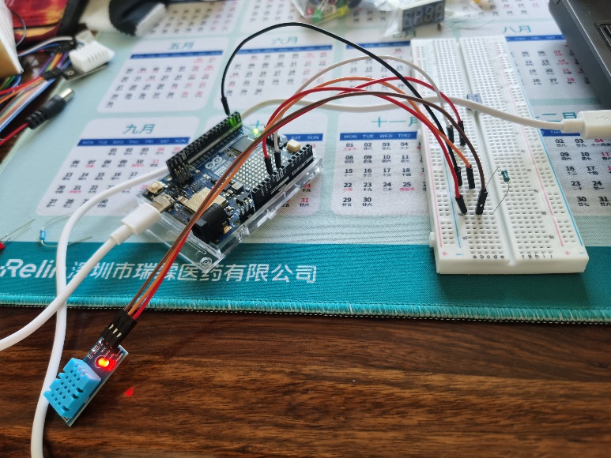
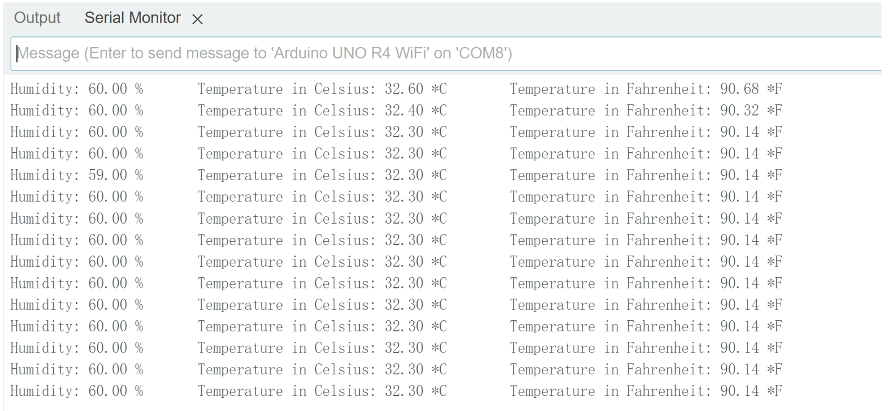
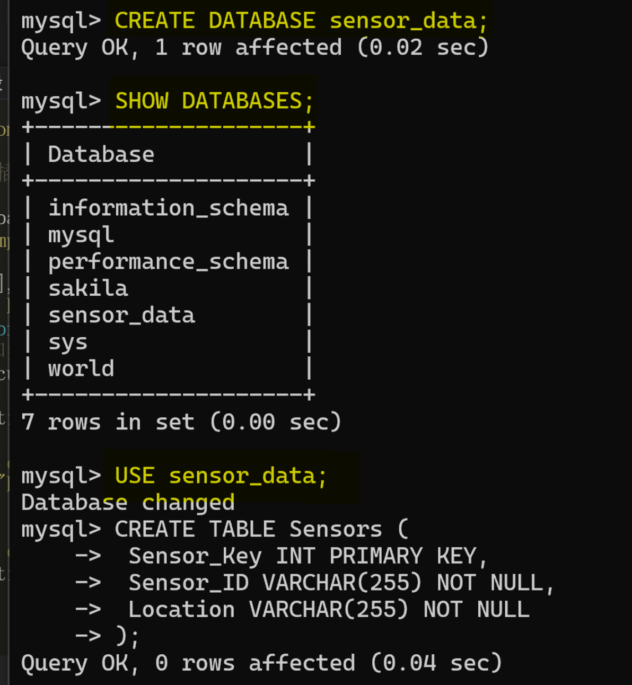
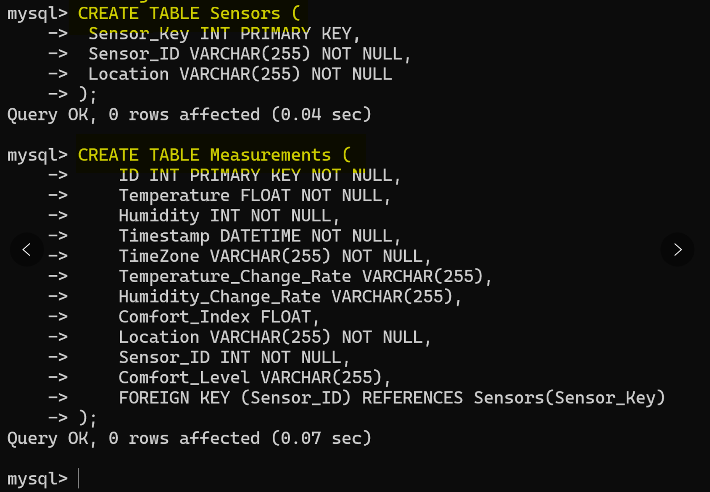
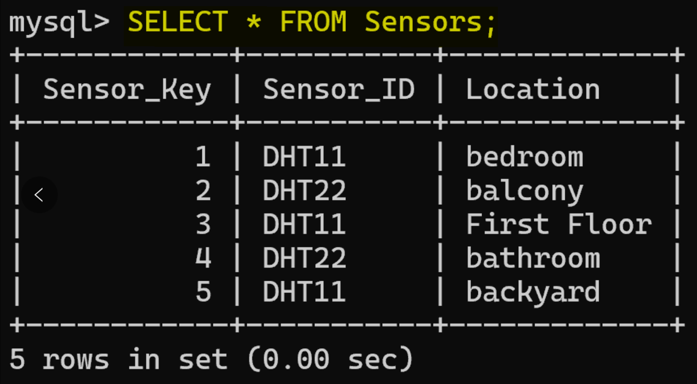
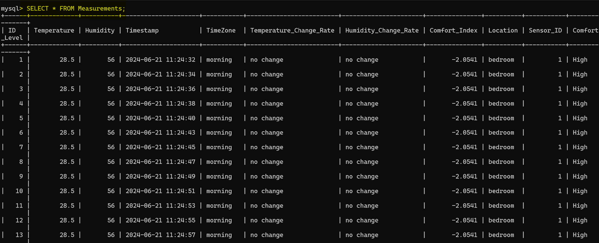
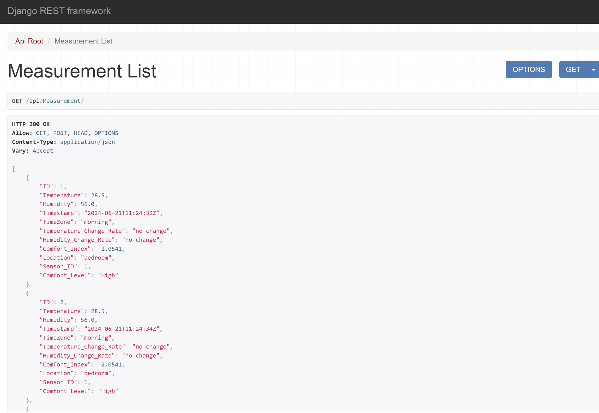
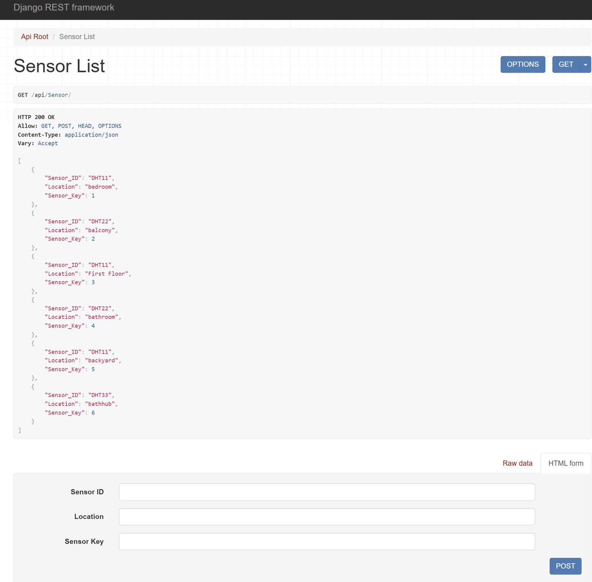
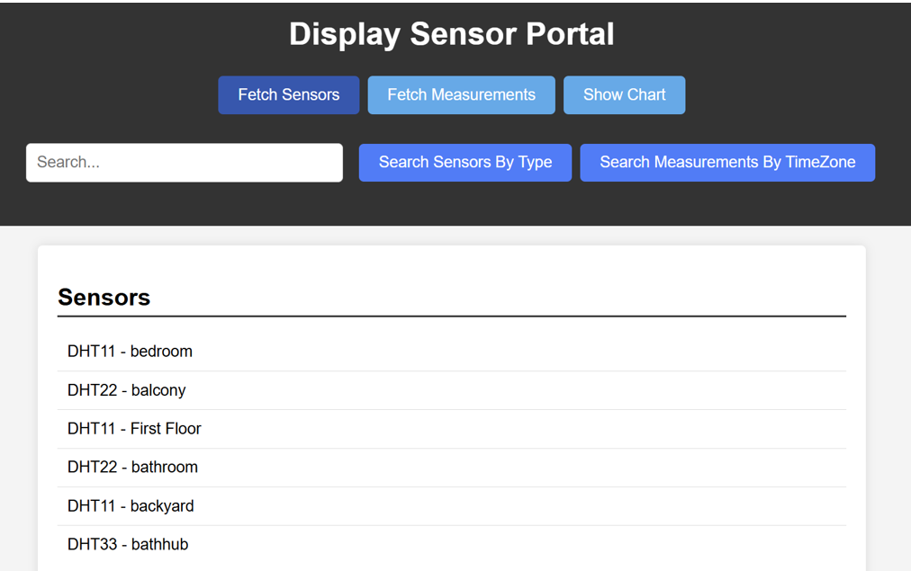
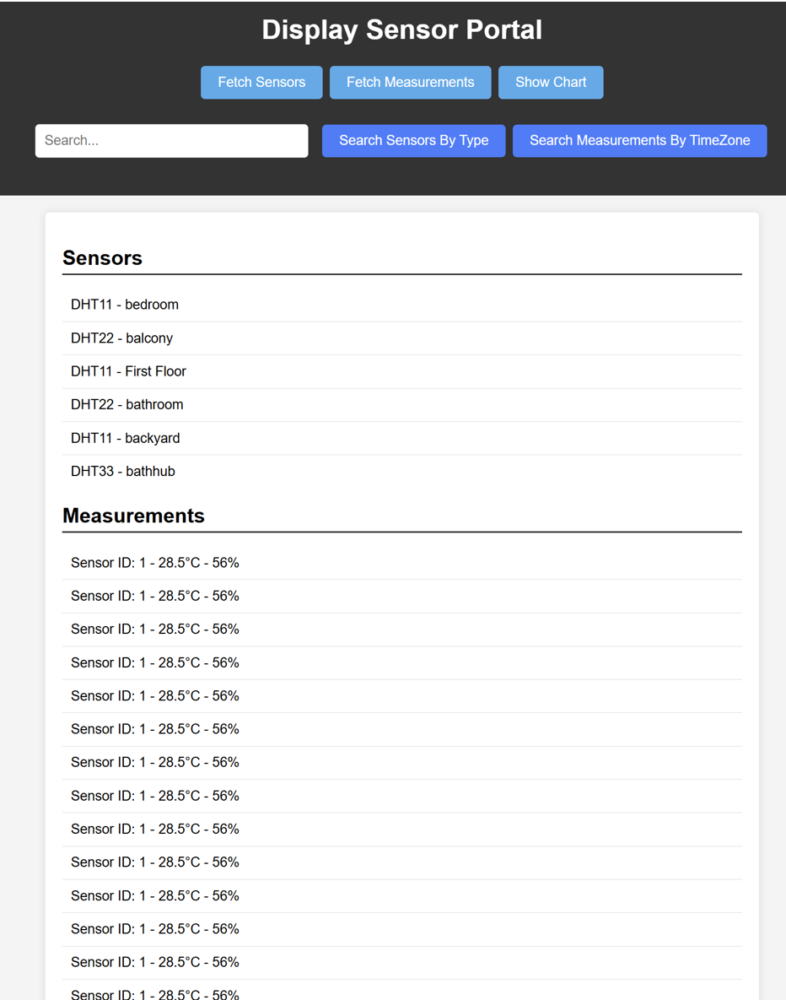
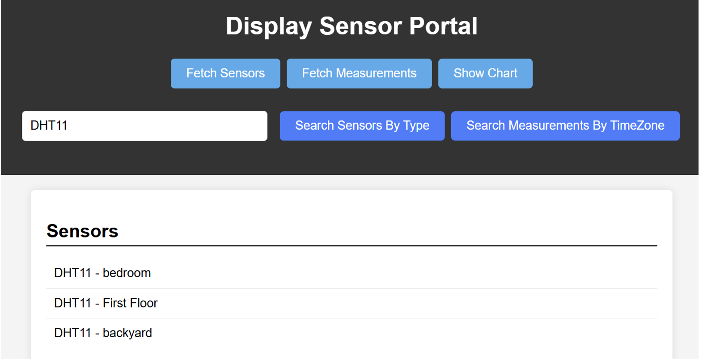
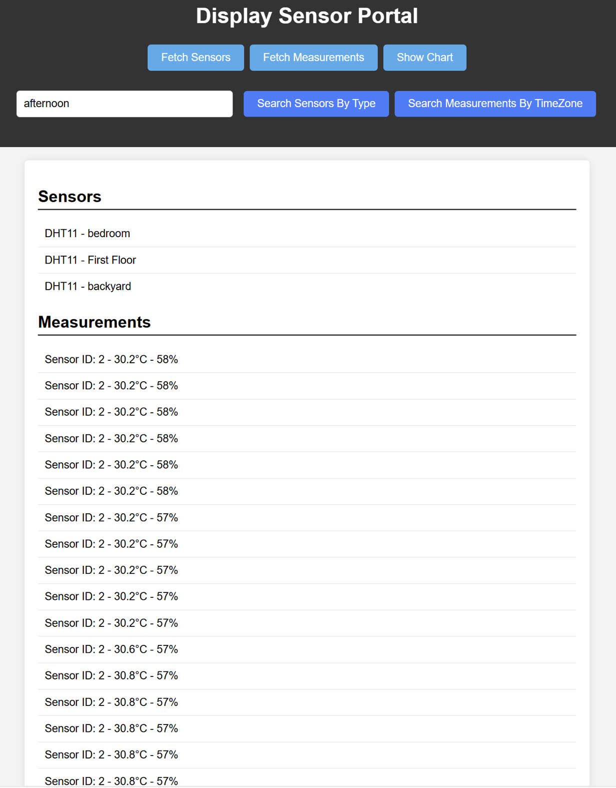
